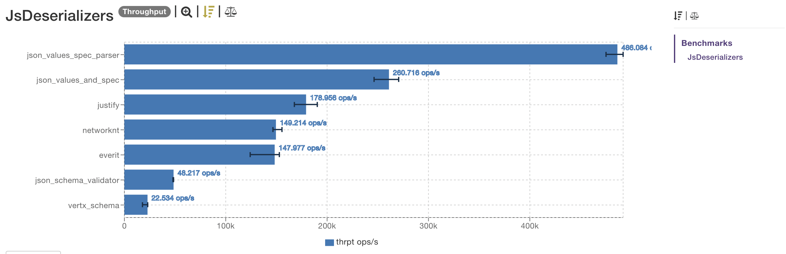

[](https://search.maven.org/artifact/com.github.imrafaelmerino/json-values/14.0.0-RC3/jar)

“_Simplicity is a great virtue, but it requires hard work to achieve it and education to appreciate
it. And to make matters worse: complexity sells better._” **Edsger Wybe Dijkstra**

- [Code wins arguments](#cwa)
- [Introduction](#introduction)
- [What to use _json-values_ for and when to use it](#whatfor)
- [When not to use it](#notwhatfor)
- [How-To](#how-to)
  - [JsPath](#jspath)
  - [JsValue](#jsvalue)
  - [Creating Jsons](#creatingjson)
    - [Creating JsObj](#creatingjsonobj)
    - [Creating JsArray](#creatingjsonarray)
  - [Putting data in and getting data out](#inout)
  - [Filter, map and reduce](#filtermapreduce)
  - [Specs](#specs)
  - [Generators](#gen)
  - [Parsers](#parsers)
  - [Optics](#optics)
- [Requirements](#requirements)
- [Installation](#installation)
- [Backward compatibility](#bc)
- [Related projects](#rp)

## <a name="cwa"><a/> Code wins arguments

**JSON creation**

Simplify JSON creation with a concise syntax:

```java

JsObj person = 
        JsObj.of("name", JsStr.of("Rafael"),
                 "languages", JsArray.of("Java", "Scala", "Kotlin"),
                 "age", JsInt.of(1),
                 "address", JsObj.of("street", JsStr.of("Elm Street"),
                                     "coordinates", JsArray.of(3.32,40.4)
                                    )
                );

```

or create a JSON template (requires Java 21 preview feature or later)

```java
public static final Processor<JsObj, RuntimeException> JS_OBJ =
      StringTemplate.Processor.of(template -> JsObj.parse(template.interpolate()));

public static final Processor<JsArray, RuntimeException> JS_ARR =
      StringTemplate.Processor.of(template -> JsArray.parse(template.interpolate()));
      
      
String name = "Joan Smith";
String number = "555-123-4567";
String address = "1 Maple Drive, Anytown";
String type = "mobile";

JsObj person = JS_OBJ."""
    {
        "name":    "\{name}",
        "address": "\{address}",
        "phone": { "type" : "\{type}",
                   "number": "\{number}"
                 }
    }
    """;
    
JsArray arrayOfPerson = JS_ARR."""
    [{
        "name":    "\{name}",
        "address": "\{address}",
        "phone": { "type" : "\{type}",
                   "number": "\{number}"
                 }
     }
    ]
    """;    
```

You can combine templates with parsers from specs to validate JSON:

```java
public static final JsObjSpec personSpec = 
    JsObjSpec.of("name", JsSpecs.str(name -> !name.isEmpty()),
                 "address", JsSpecs.str(address -> !address.isEmpty()),
                 "phone", JsObjSpec.of("type", JsSpecs.oneStringOf("mobile","landing"),
                                       "number", JsSpecs.str()
                                      )
                );

public static final JsObjSpecParser personParser = JsObjSpecParser.of(personSpec);


public static final Processor<JsObj, RuntimeException> JS_OBJ_PERSON =
      StringTemplate.Processor.of(template -> personParser.parse(template.interpolate()));

// person conforms the personSpec, otherwise an exception is thrown
JsObj person = JS_OBJ_PERSON."""
    {
        "name":    "\{name}",
        "address": "\{address}",
        "phone": { "type" : "\{type}",
                   "number": "\{number}"
                 }
    }
    """;

```

**JSON validation**

Easily define JSON validation rules using a clear and expressive syntax:

```java

JsObjSpec spec=
        JsObjSpec.of("name", str(),
                     "languages", arrayOfStr(),
                     "age", integer(),
                     "address", JsObjSpec.of("street",str(),
                                             "coordinates",tuple(decimal(),
                                                                 decimal()
                                                                )
                                            )
                     )
                  .withOptKeys("address");

```

**JSON generation made easy**

Transforming specifications into generators is effortless:

```java

Gen<JsObj> gen = SpecToGen.DEFAULT.convert(spec);

```

Further customization is possible:

```java
SpecToGen specToGen =
    SpecToGen.of(new SpecGenConfBuilder().withIntSize(10,100)
                                         .withStringLength(10,100)
                                         .withOptionalKeyProbability(4)
                );

Gen<JsObj> gen = specToGen.convert(spec);


```

Override default generators:

```java

var longitudeGen = JsBigDecGen.arbitrary(-180, 180);

var latitudeGen = JsBigDecGen.arbitrary(-90, 90);

var overrides = Map.of(JsPath.path("/address/$0"), latitudeGen,
                       JsPath.path("/address/$1"), longitudeGen
                      );

Gen<JsObj> gen = specToGen.convert(spec, overrides);

```

Create custom generators from scratch:

```java

Gen<JsObj> gen=
     JsObjGen.of("name", JsStrGen.biased(0, 100),
                 "languages", JsArrayGen.biased(JsStrGen.digit(), 0, 10),
                 "age", JsIntGen.biased(0, 100),
                 "address", JsObjGen.of("street", JsStrGen.alphanumeric(0, 200),
                                        "coordinates", JsTupleGen.of(JsBigDecGen.biased(),
                                                                     JsBigDecGen.biased()
                                                                     )
                                       )
                 )
              .withAllOptKeys()
              .withAllNullValues();

// and combine specs and generators!

Gen<JsObj> validDataGen = gen.suchThat(spec);

Gen<JsObj> invalidDataGen = gen.suchThatNo(spec);

```

The biased generators generate, with higher probability, values that are proven to cause more bugs
in our code (zero, blank strings ...).Generating robust test data is essential for identifying
potential issues in your code. With json-values, we take this a step further by introducing **biased
generators** that never forget to include special values known to trigger bugs.

**JSON SCHEMA conversion**

```java

JsObj jsonSchema = SpecToJsonSchema.convert(spec);

System.out.println(jsonSchema.toPrettyString());

```

and the result is:

```json
{
  "$schema": "https://json-schema.org/draft/2019-09/schema",
  "properties": {
    "name": {
      "type": "string"
    },
    "address": {
      "properties": {
        "street": {
          "type": "string"
        },
        "coordinates": {
          "items": {
            "items": [
              {
                "type": "number"
              },
              {
                "type": "number"
              }
            ],
            "additionalItems": false,
            "type": "array"
          },
          "type": "array"
        }
      },
      "additionalProperties": false,
      "type": "object",
      "required": ["street", "coordinates"]
    },
    "languages": {
      "items": {
        "type": "string"
      },
      "type": "array"
    },
    "age": {
      "type": "integer"
    }
  },
  "additionalProperties": false,
  "type": "object",
  "required": ["name", "languages", "age"]
}
```

Using [avro-spec](https://github.com/imrafaelmerino/avro-spec) you can convert json-values specs to
avro schemas as well:

```java
import org.apache.avro.Schema;

Schema avroSchema = SpecToAvroSchema.convert(spec);

```

**Modeling inheritance**

The json-values library simplifies the implementation of inheritance and the generation of
structured data in Java. Let's explore an example showcasing the ease of defining object
specifications, generating data, and validating against specifications.

In this example, picked from [this
article](https://json-schema.org/blog/posts/modelling-inheritance#so-is-inheritance-in-json-schema-possible)
we model a hierarchy of devices, including mice, keyboards, and USB hubs. Each device type has
specific attributes, and we use inheritance to share common fields across all device types.

```java

import jsonvalues.spec.JsSpecs;

public class ModelingInheritance {

  String NAME_FIELD = "name";
  String TYPE_FIELD = "type";
  String BUTTON_COUNT_FIELD = "buttonCount";
  String WHEEL_COUNT_FIELD = "wheelCount";
  String TRACKING_TYPE_FIELD = "trackingType";
  String KEY_COUNT_FIELD = "keyCount";
  String MEDIA_BUTTONS_FIELD = "mediaButtons";
  String CONNECTED_DEVICES_FIELD = "connectedDevices";
  String PERIPHERAL_FIELD = "peripheral";
  List<String> TRACKING_TYPE_ENUM = List.of("ball",
                                            "optical");

  @Test
  public void test() {

    var baseSpec =
        JsObjSpec.of(NAME_FIELD,
                     JsSpecs.str()
                    );

    var mouseSpec =
        JsObjSpec.of(TYPE_FIELD,
                     JsSpecs.cons(JsStr.of("mouse")),
                     BUTTON_COUNT_FIELD,
                     JsSpecs.integer(),
                     WHEEL_COUNT_FIELD,
                     JsSpecs.integer(),
                     TRACKING_TYPE_FIELD,
                     JsSpecs.oneStringOf(TRACKING_TYPE_ENUM)
                    )
                 .concat(baseSpec);

    var keyboardSpec =
        JsObjSpec.of(TYPE_FIELD,
                     JsSpecs.cons(JsStr.of("keyboard")),
                     KEY_COUNT_FIELD,
                     JsSpecs.integer(),
                     MEDIA_BUTTONS_FIELD,
                     JsSpecs.bool()
                    )
                 .concat(baseSpec);

    var usbHubSpec =
        JsObjSpec.of(TYPE_FIELD,
                     JsSpecs.cons(JsStr.of("usbHub")),
                     CONNECTED_DEVICES_FIELD,
                     JsSpecs.arrayOfSpec(JsSpecs.ofNamedSpec(PERIPHERAL_FIELD))
                    )
                 .withOptKeys(CONNECTED_DEVICES_FIELD)
                 .concat(baseSpec);

    var peripheralSpec =
        JsSpecs.ofNamedSpec(PERIPHERAL_FIELD,
                            oneSpecOf(JsSpecs.ofNamedSpec("mouse",
                                                          mouseSpec),
                                      JsSpecs.ofNamedSpec("keyboard",
                                                          keyboardSpec),
                                      JsSpecs.ofNamedSpec("usbHub",
                                                          usbHubSpec)));

    var peripheralGen = SpecToGen.DEFAULT.convert(peripheralSpec);

    var parser = JsObjSpecParser.of(peripheralSpec);

    peripheralGen.sample(10)
                 .peek(System.out::println)
                 .forEach(obj -> {
                            Assertions.assertEquals(obj,
                                                    parser.parse(obj.toString())
                                                   );

                            Assertions.assertTrue(peripheralSpec.test(obj)
                                                                .isEmpty());
                          }
                         );
  }

}

```

Let's convert the spec into a json schema

```java

JsObj jsonSchema = SpecToJsonSchema.convert(peripheralSpec);
System.out.println(jsonSchema.toPrettyString());

```

and the result is:

```json
{
  "$schema": "https://json-schema.org/draft/2019-09/schema",
  "defs": {
    "mouse": {
      "properties": {
        "name": {
          "type": "string"
        },
        "trackingType": {
          "enum": ["ball", "optical"],
          "type": "string"
        },
        "wheelCount": {
          "type": "integer"
        },
        "type": {
          "const": "mouse"
        },
        "buttonCount": {
          "type": "integer"
        }
      },
      "additionalProperties": false,
      "type": "object",
      "$id": "mouse",
      "required": ["type", "buttonCount", "wheelCount", "trackingType", "name"]
    },
    "keyboard": {
      "properties": {
        "name": {
          "type": "string"
        },
        "keyCount": {
          "type": "integer"
        },
        "type": {
          "const": "keyboard"
        },
        "mediaButtons": {
          "type": "boolean"
        }
      },
      "additionalProperties": false,
      "type": "object",
      "$id": "keyboard",
      "required": ["type", "keyCount", "mediaButtons", "name"]
    },
    "peripheral": {
      "oneOf": [
        {
          "$ref": "#/defs/mouse"
        },
        {
          "$ref": "#/defs/keyboard"
        },
        {
          "$ref": "#/defs/usb_hub"
        }
      ]
    },
    "usb_hub": {
      "properties": {
        "name": {
          "type": "string"
        },
        "connectedDevices": {
          "items": {
            "$ref": "#/defs/peripheral"
          },
          "type": ["array", "null"]
        },
        "type": {
          "const": "usb_hub"
        }
      },
      "additionalProperties": false,
      "type": "object",
      "$id": "usb_hub",
      "required": ["type", "name"]
    }
  },
  "$ref": "#/defs/peripheral",
  "$id": "peripheral"
}
```

This example illustrates the straightforward approach of implementing inheritance and generating
structured data using json-values. The library's features make it easy to model complex hierarchies,
generate diverse data, and ensure compliance with defined specifications.

**Optics: Elevating JSON Manipulation to a New Level**

Perform JSON manipulation free of null checks and if-else conditions using optics:

```java

//let's craft a function using lenses and optionals
Function<JsObj, JsObj> modify =
    ageLens.modify.apply(n -> n + 1)
           .andThen(nameLens.modify.apply(String::trim))
           .andThen(cityOpt.set.apply("Paris"))
           .andThen(latitudeLens.modify.apply(lat -> -lat))
           .andThen(languagesLens.modify.apply(lan -> lan.append(JsStr.of("Clojure"))));

JsObj updated = modify.apply(person);

```

No if-else conditions, no null checks, and I'd say it's pretty expressive and concise. As you may
notice, each field has an associated optic defined:

- age -> ageLens
- name -> nameLens
- city -> cityOpt
- latitude -> latitudeLens etc

and we just create functions, like `modify` in the previous example, putting optics together
(composition is key to handle complexity).

**Filter and map were never so easy!**

- json-values simplifies complex JSON data operations into concise and readable code.
- Transform keys, values, or both effortlessly, allowing you to adapt data to your specific needs.
- Apply filters to remove unwanted data, ensuring your JSON conforms to your expectations.

```java
// Define a function to convert keys to snake_case
Function<String, String> toSneakCase = key -> {...};

// Map keys to snake_case, trim string values, and filter out null values
json.mapKeys(toSneakCase)
    .mapValues(JsStr.prism.modify.apply(String::trim))
    .filterValues(JsValue::isNotNull);

```

**Efficient JSON Parsing and Validation**

Parsing and validating JSON data can be a time-consuming process, especially when dealing with large
payloads. json-values offers a more efficient and convenient approach by interleaving parsing and
validation without the need to parse the entire JSON. Here's how it works:

```java
// Define your JSON schema using JsObjSpec
JsObjSpec spec = ???;

// Create a parser with the specified schema
var parser = JsObjSpecParser.of(spec);

// Parse and validate JSON data, efficiently checking only what's necessary
var json = parser.parse("{...}");

```

And that's all. And what about performance?

I've put json-values to the test against various JSON schema implementations listed on
[json-schema.org](https://json-schema.org/implementations.html). The results speak for themselves
(benchmark using [jmh](https://openjdk.java.net/projects/code-tools/jmh/)):



You can find more details in the class
[JsDeserializers](./../benchmarking/src/main/java/jsonvalues/benchmark/JsDeserializers.java)

Did you see that!?

Note: If you are the author of one of the other tested libraries or are aware of alternative
solutions that could further enhance performance, we are more than open to collaboration and welcome
any suggestions for improvement. Our goal is to continually refine and optimize our library to
benefit the community.

**Minimalistic and Focused**

json-values prides itself on its minimalistic and focused approach to JSON manipulation. With only
one very small dependency, [java-fun](https://github.com/imrafaelmerino/java-fun), I've
intentionally kept the library lightweight and uncluttered.

- When you hit the autocomplete button in your favorite IDE, you won't be overwhelmed by thousands
  of unnecessary classes. We believe in providing a clean and streamlined development experience.
- Our commitment to encapsulation ensures that only the essential classes, those relevant to the
  client perspective, are exposed.

By maintaining a small and tightly focused scope, json-values offers you a hassle-free and efficient
way to work with JSON data without unnecessary complexity.

## <a name="introduction"><a/> Introduction

Welcome to json-values, a groundbreaking JSON library for Java that harnesses the power of
persistent data structures.

In the world of Functional Programming (FP), immutable data structures, often referred to as
"values," hold a pivotal role. Working with values isn't just a best practice; it's a proven way to
reduce bugs, enhance code readability, and simplify maintenance. Effective Java, Item 17, emphasizes
the importance of minimizing mutability, but this sometimes comes at the expense of performance due
to the inefficiency of traditional "copy-on-write" approaches for large data structures. This is
where persistent data structures step in.

While languages like Haskell, Clojure, and Scala natively support persistent data structures, Java
has traditionally lagged behind in this regard.

json-values aims to bridge this gap, allowing Java developers to harness the power of persistent
data structures when working with JSON data. Here's why this matters:

- In FP, the focus is on functions and values, simplifying complex data manipulation.
- By providing a purely functional approach to JSON, json-values opens the door to more robust and
  reliable code.
- Say goodbye to the traditional complexities of working with JSON objects and embrace a more
  straightforward, functional approach.

With json-values, you can unlock the potential of FP in your Java projects, creating cleaner, more
maintainable code while ensuring that performance doesn't take a back seat. Let's dive into how you
can leverage the strength of values and functions to manipulate JSON data effectively.

## <a name="whatfor"><a/> What to use json-values for and when to use it

json-values is a versatile library designed to simplify JSON manipulation while embracing a
functional programming paradigm. Here are scenarios where you can benefit from using json-values:

- **Functional Style in Java**: If you want to work with JSON in a functional style, leveraging
  functions and values, json-values provides a solution in Java, even in the absence of native
  persistent data structures.

- **End-to-End JSON Architectures**: In architectures where JSON is the lingua franca, using a
  persistent JSON representation ensures both safety and efficiency. Think of scenarios where actors
  exchange JSON messages seamlessly.

- **Streamlined JSON Manipulation**: If you frequently manipulate JSON data and seek a more
  declarative and less ceremonious approach, json-values offers a powerful API built on functional
  programming principles.

- **Property-Based Testing**: Simplify property-based testing by effortlessly generating JSON data
  with json-values, making it a breeze to explore edge cases and unexpected scenarios.

- **Efficient JSON Validation**: Create JSON specifications for efficient validation and parsing of
  JSON data, ensuring data integrity and accuracy.

- **Simplicity Matters**: Embrace simplicity in your JSON manipulation. As the saying goes,
  "Immutability Changes Everything," and json-values brings simplicity and reliability to your code.

json-values empowers you to work with JSON in a more functional, efficient, and straightforward
manner, offering a versatile toolkit for various use cases.

## <a name="notwhatfor"><a/> When not to use it

**Avoid Over-engineering**

json-values is a powerful tool for working with JSON data in a straightforward and expressive
manner. However, it's essential to exercise restraint and avoid creating overly complex
abstractions, especially if they involve excessive use of getters and setters or intricate DSLs
built on top of json-values.

**Watch "Narcissistic Design"**

If you're interested in exploring this concept further, you can watch the thought-provoking talk
titled "Narcissistic Design" by Stuart Halloway. This presentation offers an ironic take on the
pitfalls of over-engineering and the importance of keeping design decisions pragmatic and focused on
solving real-world challenges.

## <a name="how-to"><a/> How-To

### <a name="jspath"><a/>JsPath: Navigating JSON Structures

The `JsPath` class in json-values represents a way to pinpoint specific values within a JSON
structure. It's essentially a sequence of positions, where each position can be either a key or an
index. There are two convenient ways to create a `JsPath`:

- Parsing from a Path-Like String: You can parse a path-like string using the static factory method
  `JsPath.path`. The path string should follow the JSON Pointer specification defined in [RFC
  6901](http://tools.ietf.org/html/rfc6901).

```java

JsPath path = JsPath.path("/a/b/0");

Position head = path.head();

Assertions.assertEquals(head,
                        Key.of("a")
                       );

JsPath tail = path.tail();

Assertions.assertEquals(tail.head(),
                        Key.of("b")
                       );

Assertions.assertEquals(tail.last(),
                        Index.of(0)
                       );
```

- Creating Incrementally: Alternatively, you can create a JsPath incrementally using static factory
  methods JsPath.fromKey or JsPath.fromIndex to start with a one-position path. Then, use the key or
  index methods to append more keys or indexes.

```java

JsPath.fromKey("a")
      .key("b")
      .index(0);

```

Or, you can start with an empty path:

```java

JsPath.empty().key("a")
              .key("b")
              .index(0);

```

### <a name="jsvalue"><a/>JsValue: The Foundation of JSON Elements

In json-values, every element in a JSON structure is represented as a subtype of `JsValue`. This
includes various types described in [json.org](https://www.json.org):

- String
- Number
- Null
- JSON Object
- JSON Array

Additionally, json-values extends support for two more data types:

- Instant: Serialized into its string representation following ISO-8601 standards.
- Binary: Represented as an array of bytes (byte[]), serialized into a base64-encoded string.

To ensure data integrity and consistency, json-values takes a data-oriented approach when comparing
JSON elements. In other words, two JSON structures are considered equal if they convey the same
information. Even if the values have different primitive types or the keys are in a different order,
as long as they represent the same data, they are considered equal.

Here's the hierarchical class structure of json-values:

- JsValue
  - JsPrimitive
    - JsStr
    - JsInt
    - JsDouble
    - JsLong
    - JsBigInt
    - JsBigDec
    - JsInstant
    - JsBool
    - JsBool.TRUE (singleton instance)
    - JsBool.FALSE (singleton instance)
    - JsNull
    - JsNull.NULL (singleton instance)
  - Json
    - JsObj
    - JsArray

For example, consider the following JSON representations, `xs` and `ys`:

```java
JsObj xs = JsObj.of("a", JsInt.of(1000),
                    "b", JsBigDec.of(BigDecimal.valueOf(100_000_000_000_000L)),
                    "c", JsInstant.of("2022-05-25T14:27:37.353Z"),
                    "d", JsStr.of("aGkh")
                   );

JsObj ys = JsObj.of("b", JsBigInt.of(BigInteger.valueOf(100_000_000_000_000L)),
                    "a", JsLong.of(1000L),
                    "d", JsBinary.of("hi!".getBytes(StandardCharsets.UTF_8)),
                    "c", JsStr.of("2022-05-25T14:27:37.353Z")
                   );

```

Despite the differences in types and key orders, both xs and ys represent the same piece of
information:

```json
{
  "a": 1000,
  "b": 100000000000000,
  "c": "2022-05-25T14:27:37.353Z",
  "d": "aGkh"
}
```

As a result, json-values considers them equal, including their hashcode:

```java

Assertions.assertEquals(xs, ys);
Assertions.assertEquals(xs.hashcode(), ys.hashcode());

```

### <a name="creatingjson"><a/>Creating JSON with json values

There are several ways of creating JSON in json-values:

1. **Using Static Factory Methods**: You can create JSON objects with up to 30 key-value pairs using
   the static factory methods `of`. This approach is ideal for straightforward JSON creation.

2. **Parsing from Bytes or String**: If you have a JSON string or byte array and the schema of the
   JSON is known, you can efficiently parse it. This method is particularly fast when you define a
   parser from a spec, which we'll discuss later.

3. **Creating an Empty Object**: You can start with an empty JSON object (or from an existing one)
   and then use the API to insert values. This approach allows for dynamic construction of JSON.

Now, let's delve into creating JSON objects and arrays with json-values:

### <a name="creatingjsonobj"><a/>Creating JsObj: JSON objects

Let's start with creating a JSON object that represents a person:

```json
{
  "name": "Rafael",
  "surname": "Merino",
  "phoneNumber": 6666666,
  "registrationDate": "2019-01-21T05:47:26.853Z",
  "addresses": [
    {
      "coordinates": [39.8581, -4.02263],
      "city": "Toledo",
      "zipCode": "45920",
      "tags": ["homeAddress"]
    },
    {
      "coordinates": [39.8581, -4.02263],
      "city": "Madrid",
      "zipCode": "28029",
      "tags": ["workAddress"]
    }
  ]
}
```

**Using the static factory methods:**

```java

JsObj person=
        JsObj.of("name", JsStr.of("Rafael"),
                 "surname", JsStr.of("Merino"),
                 "phoneNumber", JsStr.of("6666666"),
                 "registrationDate", JsInstant.of("2019-01-21T05:47:26.853Z"),
                 "addresses", JsArray.of(JsObj.of("coordinates", JsArray.of(39.8581, -4.02263),
                                                  "city", JsStr.of("Toledo"),
                                                  "zipCode", JsStr.of("45920"),
                                                  "tags", JsArray.of("workAddress")
                                                  ),
                                         JsObj.of("coordinates", JsArray.of(40.4168, 3.7038),
                                                  "city", JsStr.of("Madrid"),
                                                  "zipCode", JsStr.of("28029"),
                                                  "tags", JsArray.of("homeAddress", "amazon")
                                                  )
                                         )
                 );

```

You can see that defining the JSON object using json-values is similar to raw JSON. It's a recursive
data structure, allowing you to nest JSON objects as needed.

Rather than specifying keys within a nested structure, you can create a JSON object directly from
their respective paths, offering a highly convenient alternative:

```java

JsObj person =
        JsObj.of(path("/name"), JsStr.of("Rafael"),
                 path("/surname"), JsStr.of("Merino"),
                 path("/phoneNumber"), JsStr.of("6666666"),
                 path("/registrationDate"), JsInstant.of("2019-01-21T05:47:26.853Z"),
                 path("/addresses/0/coordinates/0"), JsDouble.of(39.8581),
                 path("/addresses/0/coordinates/1"), JsDouble.of(-4.02263),
                 path("/addresses/0/city"), JsStr.of("Toledo"),
                 path("/addresses/0/tags"), JsArray.of("workAddress"),
                 path("/addresses/1/coordinates/0"), JsDouble.of(40.4168),
                 path("/addresses/1/coordinates/1"), JsDouble.of(3.7038),
                 path("/addresses/1/city"), JsStr.of("Madrid"),
                 path("/addresses/1/tags"), JsArray.of("homeAddress")
                );

```

**Parsing a string and the schema of the JSON object is unknown:**

```java

JsObj a = JsObj.parse("{...}");

```

**Parsing a string and the schema of the JSON object is known:**

In this case, the best and fastest option is to use a spec to do the parsing. We'll talk about this
option later on when I introduce json-spec.

**Creating an empty object (or from an existing JsObj) and adding new values with the method
`set`:**

```java

JsObj person=
        JsObj.empty().set("name", "Rafael")
                     .set("surname", "Merino")
                     .set("phoneNumber", "6666666");

```

Remember that a JSON is immutable, so the set method returns a brand-new value.

### <a name="creatingjsonarray"><a/>Creating JsArray: JSON Arrays

**From primitive types using the static factory method `of` and _varargs_:**

```java

JsArray a = JsArray.of("apple", "orange", "pear");

JsArray b = JsArray.of(1, 2, 3, 4);

```

**From JSON values using the static factory method `of` and _varargs_:**

```java

JsArray a = JsArray.of(JsStr.of("hi"),
                       JsInt.of(1),
                       JsBool.TRUE,
                       JsNull.NULL
                      );

```

**From an iterable of JSON values:**

```java

List<JsValue> list = ???;
Set<JsValue> set = ???;

JsArray.ofIterable(list);
JsArray.ofIterable(set);

```

**Parsing a string and the schema of the JSON array is unknown:**

```java

JsArray a = JsArray.parse("[...]");

```

**Parsing a string and the schema of the JSON array is known:**

In this case, like parsing objects with a schema, the best and fastest option is to use a spec to do
the parsing. We'll also talk about this option later on when I introduce json-spec.

**Creating an empty array and adding new values with the methods `append` and `prepend`:**

```java

JsArray a = JsArray.empty().append(JsInt.of(1))
                           .prepend(JsInt.of(0));

JsArray b = JsArray.empty().append(JsInt.of(3))
                           .prepend(JsInt.of(2));

Assertions.assertEquals(JsArray.of(0,1,2,3),
                        a.appendAll(b));

Assertions.assertEquals(JsArray.of(2,3,0,1),
                        a.prependAll(b));

```

### <a name="inout"><a/>Putting data in and getting data out

Two important methods in the API are `get` and `set`:

```java

Json:: JsValue get(JsPath path);

Json:: Json set(JsPath path, JsValue value);
Json:: Json set(JsPath path, JsValue value, JsValue padWith);

```

The get method always returns a JsValue, regardless of the path passed in. If there is no element at
the specified path, it returns the special value JsNothing.NOTHING. It adheres to the principles of
total functions, a fundamental concept in functional programming. The method's signature accurately
reflects its behavior, avoiding exceptions and surprises.

Similarly, when you set a value at a specific path, it will always be created, including any
necessary containers and padding arrays. You can confidently expect that the value will be at the
specified path, as demonstrated by the following property:

```java

Assertions.assertEquals(value,
                        obj.set(path, value)
                           .get(path));

```

Setting JsNothing at a path removes the value, ensuring that get returns JsNothing:

```java

Assertions.assertEquals(JsNothing.NOTHING,
                        obj.set(path, JsNothing.NOTHING)
                           .get(path));

```

Functional programming is founded on principles of honesty and adherence to laws, making it easier
to reason about code. Additionally, the set method always returns a brand-new JSON. Remember, JSONs
are immutable and implemented with persistent data structures in json-values.

Let's look at some examples:

```java

JsObj.empty().set(path("/food/fruits/0"),
                  "apple"
                 );

{
  "food": {
    "fruits": [
      "apple"
    ]
  }
}


// pads with null by default
JsObj.empty().set(path("/food/fruits/2"),
                  "apple"
                  );

{
  "food": {
    "fruits": [
      null,
      null,
      "apple"
    ]
  }
}

// padding with empty string
JsObj obj = JsObj.empty().set(path("/food/fruits/2"),
                              JsStr.of("apple"),
                              JsStr.of(""));

{
  "food": {
    "fruits": [
      "",
      "",
      "apple"
    ]
  }
}

Assertions.assertEquals(JsStr.of(""),
                        obj.getStr(path("/food/fruits/2")));

Assertions.assertEquals(JsNothing.NOTHING,
                        obj.get(path("/food/fruits/5")));

```

You may want to retrieve Java primitive types directly. In this case, if there is no element at the
specified path, the following methods return null, unless you specify a supplier to produce a
default value:

```java

JsArray getArray(JsPath path);
JsArray getArray(JsPath path, Supplier<JsArray> orElse);

BigDecimal getBigDec(JsPath path);
BigDecimal getBigDec(JsPath path, Supplier<BigDecimal> orElse);

BigInteger getBigInt(JsPath path);
BigInteger getBigInt(JsPath path, Supplier<BigInteger> orElse);

byte[] getBinary(JsPath path);
byte[] getBinary(JsPath path, Supplier<byte[]> orElse);

Boolean getBool(JsPath path);
Boolean getBool(JsPath path, Supplier<Boolean> orElse);

Double getDouble(JsPath path);
Double getDouble(JsPath path, Supplier<Double> orElse);

Instant getInstant(JsPath path);
Instant getInstant(JsPath path, Supplier<Instant> orElse);

Integer getInt(JsPath path);
Instant getInt(JsPath path, Supplier<Instant> orElse);

Long getLong(JsPath path);
Long getLong(JsPath path, Supplier<Long> orElse);

JsObj getObj(JsPath path);
JsObj getObj(JsPath path, Supplier<JsObj> orElse);

String getStr(JsPath path);
String getStr(JsPath path, Supplier<String> orElse);


```

To retrieve data from the first level of a JSON, you can simply pass in the key or index, which is
less verbose:

```java

obj.getStr("a")

array.getStr(0)

```

### <a name="filtermapreduce"><a/>Filter, map, and reduce

Let's take a look at some very common transformations using the `map` methods. The map function
doesn't change the structure of the JSON. This is a pattern known in FP as a functor. Consider the
following signatures:

```java
Json mapValues(Function<JsPrimitive, JsValue> map);

Json mapKeys(Function<String, String> map);

Json mapObjs(Function<JsObj, JsValue> map);

Json mapValues(Function<JsPrimitive, JsValue> map);

```

All of these methods traverse the entire JSON structure recursively.

The mapKeys function transforms all the keys of JSON objects. A typical use case is when you want to
convert from camel case format to snake case.

The mapValues function operates on primitive types (not objects or arrays) and transforms them into
another value.

Now, here's where it gets interesting:

If the mapping depends not only on the value but also on its position in the JSON, you can pass the
full path to the map function using the following overloaded methods:

```java

Json mapKeys(BiFunction<JsPath, JsValue, String> map);

Json Json mapValues(BiFunction<JsPath, JsPrimitive, JsValue> map);

Json mapObjs(BiFunction<JsPath, JsObj, JsValue> map);

```

Using these methods with paths provides precise control over where the transformation occurs within
the JSON structure. It allows you to apply transformations that are context-aware, considering both
the value and its position.

Now, let's look at the filter methods. The filter methods are used to selectively include or exclude
elements from the JSON based on specific criteria. Here are the equivalent filter methods:

```java


Json filterValues(Predicate<JsPrimitive> filter);

Json filterKeys(Predicate<String> filter);

Json filterObjs(Predicate<JsObj> filter);

```

Similarly to the map methods, these filter methods traverse the entire JSON structure recursively.
They allow you to selectively include or exclude elements from the JSON based on the specified
criteria. Now, here's the key point:

If the filtering depends on both the value and its position in the JSON, you can pass the full path
to the filter function using the following overloaded methods:

```java
Json filterKeys(BiPredicate<JsPath, JsValue> filter);

Json filterValues(BiPredicate<JsPath, JsPrimitive> filter);

Json filterObjs(BiPredicate<JsPath, JsObj> filter);
```

These filter methods provide powerful ways to filter JSON data based on various conditions, and
using paths allows you to precisely pinpoint where the filtering takes place within the JSON
structure. It's incredibly useful for context-aware transformations and filtering.

And finally, let's take a look at the reduce operations from json-values.

The `reduce` methods in json-values provide powerful capabilities for reducing JSON data, allowing
you to aggregate and process JSON values based on specific conditions. These operations can be
applied selectively, and you can choose whether to access the element's path during the reduction
process.

```java

//`reduce` with Path, Predicate, and Mapping

<R> Optional<R> reduce(BinaryOperator<R> op,
                       BiFunction<? super JsPath, ? super JsPrimitive, R> map,
                       BiPredicate<? super JsPath, ? super JsPrimitive> predicate
                       );

```

This method enables you to reduce the values of a JSON object while providing access to the
element's path. You can perform custom reduction operations using the provided operator `op` and
`map` the path and primitive value to a result of type `R` using the map function. The `predicate
determines which values are included in the reduction. It's important to note that this method
traverses the entire JSON structure recursively.

```java
//reduce with Predicate and Mapping

<R> Optional<R> reduce(BinaryOperator<R> op,
                       Function<? super JsPrimitive, R> map,
                       Predicate<? super JsPrimitive> predicate
                       );
```

This method allows you to reduce the values of a JSON object without accessing the element's path.
You can specify the operator `op` to apply to values of type `R` and map the values to the desired
type `R` using the map function. The `predicate` determines which values are included in the
reduction. Just like the previous method, it traverses the entire JSON structure recursively.

**Example:** Suppose you have a JSON object representing sales data, and you want to calculate the
total revenue from products that meet specific criteria. You can use the reduce methods to perform
this custom reduction operation.

Using these reduce methods, you can tailor reduction operations to your specific use cases, whether
you need access to the element's path or not. This flexibility empowers you to efficiently process
and aggregate JSON values in a way that suits your needs.

### <a name="specs"><a/>JSON validation with specs made easy

JSON validation is essential to ensure that the data you receive or produce conforms to a specified
schema. In this section, we'll explore how to define and use JSON specifications, often referred to
as "specs," to validate JSON data.

You can define JSON specs in a concise and expressive manner, making the validation process
straightforward. Consider the following example of a JSON spec for a person's data:

```java

JsArraySpec addressesSpec =
       JsSpecs.arrayOfSpec(JsObjSpec.of("coordinates",tuple(decimal(),
                                                            decimal()
                                                           ),
                                        "city",str(),
                                        "tags",arrayOfStr(),
                                        "zipCode",str()
                                        )
                                    .lenient()
                          );

JsObjSpec personSpec =
        JsObjSpec.of("name",str(),
                     "surname",str(),
                     "phoneNumber",str(),
                     "registrationDate",instant(),
                     "addresses", addressesSpec
                     );

List<SpecError> errors=personSepc.test(person);

Function<SpecError, String> toStr =
       error -> "%s @ %s doesn't conform spec: %s".formatted(error.value,
                                                             error.path,
                                                             error.codeCode);
errors.forEach(pair -> System.out.println(toStr.apply(pair)));

```

Writing specs feels like writing JSON. Specs by default are strict, which means that they don't
allow keys that are not specified, whereas lenient ones do. Turning strict specs into lenient ones
is as easy as calling the method _lenient_.

The real power is that you can create specs from predicates and compose them:

```java

BiFunction<Integer, Integer, Predicate<String>> lengthBetween=
     (min,max) -> string -> string.length() <= max && string.length() >= min;

BiFunction<Instant, Instant, Predicate<Instant>> instantBetween=
     (min,max) -> instant -> min.isBefore(instant) && max.isAfter(instant);

BiFunction<Long, Long, Predicate<BigDecimal>> decBetween=
     (min,max) ->n -> BigDecimal.valueOf(min).compareTo(n) < 0
                        && BigDecimal.valueOf(max).compareTo(n)>0;

int MAX_NAME_LENGTH=10;
int MAX_SURNAME_LENGTH=10;
int MAX_PHONE_LENGTH=10;
int MAX_CITY_LENGTH=20;
int MAX_TAG_LENGTH=20;
int MAX_ZIPCODE_LENGTH=30;
int MIN_ADDRESSES_SIZE=1;
int MAX_ADDRESSES_SIZE=100;
int MAX_TAGS_SIZE=10;
long LAT_MIN=-90;
long LAT_MAX=90;
long LON_MIN=-180;
long LON_MAX=180;


Predicate<String> nameSpec = lengthBetween.apply(0,MAX_NAME_LENGTH);

Predicate<String> surnameSpec = lengthBetween.apply(0,MAX_SURNAME_LENGTH);

Predicate<String> phoneSpec = lengthBetween.apply(0,MAX_PHONE_LENGTH);

Predicate<Instant> registrationDateSpec = instantBetween.apply(Instant.EPOCH, Instant.MAX);

Predicate<BigDecimal> latitudeSpec = decBetween.apply(LAT_MIN,LAT_MAX);

Predicate<BigDecimal> longitudeSpec = decBetween.apply(LON_MIN,LON_MAX);

Predicate<String> citySpec = lengthBetween.apply(0,MAX_CITY_LENGTH);

Predicate<String> tagSpec = lengthBetween.apply(0,MAX_TAG_LENGTH);

Predicate<String> zipCodeSpec = lengthBetween.apply(0,MAX_ZIPCODE_LENGTH);

JsArraySpec addressesSpec =
    arrayOfSpec(JsObjSpec.of("coordinates", tuple(decimal(latitudeSpec),
                                                  decimal(longitudeSpec)
                                                 ),
                             "city", str(citySpec),
                             "tags", arrayOfStr(tagSpec, 0, MAX_TAGS_SIZE),
                             "zipCode", str(zipCodeSpec)
                             )
                          .lenient()
                          .withOptKeys("tags","zipCode","city"),
                MIN_ADDRESSES_SIZE,
                MAX_ADDRESSES_SIZE
                );

JsObjSpec personSpec =
    JsObjSpec.of("name", str(nameSpec),
                 "surname", str(surnameSpec),
                 "phoneNumber", str(phoneSpec).nullable(),
                 "registrationDate", instant(registrationDateSpec),
                 "addresses", addressesSpec
                 )
              .withOptKeys("surname","phoneNumber","addresses");

```

As you can see, the spec's structure remains the same, and it’s child’s play to define optional and
nullable fields.

Another interesting spec you can define is map, i.e, an arbitrary number of keys and their
associated values of the same type. For example a map of numbers or booleans etc.

```java

JsObjSpec a = JsObjSpec.of("name",
                           str(),
                           "grades",
                           mapOfInteger()
                          );

List<SpecError> errors =
    spec.test(JsObj.of("name",
                       JsStr.of("Rafael"),
                       "grades",
                       JsObj.of("Maths",
                                JsInt.of(10),
                                "Science",
                                JsInt.of(8),
                                "Geography",
                                JsInt.of(8)
                               )
                      )
             );

```

It's possible to validate a whole JsObj once parsed with the method `suchThat`. Imagine that certain
properties must be present if a given property is present in an object. For example, suppose we have
a schema representing a customer. If you have their credit card number, you also want to ensure you
have a billing address. If you don’t have their credit card number, a billing address would not be
required:

```java

Predicate<JsObj> existsBillingIfCard =
     person -> !person.containsKey("credit_card")
                || person.containsKey("billing_address");;

JsObjSpec customerSpec=
        JsObjSpec.of("credit_card", str(),
                     "billing_address", str()
                     )
                 .withOptKeys("credit_card",
                              "billing_address")
                 .suchThat(existsBillingIfCard);

```

Another exciting thing we can do with specs is parsing strings or bytes. Instead of parsing the
whole JSON and then validating it, we can verify the schema while parsing it and stop the process as
soon as an error happens. **After all, failing fast is important as well!**

```java

JsObjSpecParser personParser = JsObjSpecParser.of(personSpec);

String string = "{...}";

try{
     JsObj person = personParser.parse(string);
   }
catch(JsParserException e){
     System.out.println("Error parsing person JSON: " +e.getMessage())
}

```

Another compelling feature is the use of named specs, which simplifies the creation of recursive
specifications. To implement this, start by creating a spec with `JsObjSpecBuilder` or
`JsObjSpecs.ofNamedSpec(name, spec)` to give it a name . Then, refer to it using the
`JsSpecs.ofNamedSpec(name)` method within its own definition.

```java

var spec =
    JsObjSpecBuilder.withName("person")
                    .build(JsObjSpec.of("name", JsSpecs.str(),
                                        "image", JsSpecs.fixedBinary(10*1024),
                                        "age", JsSpecs.integer(),
                                        "father", JsSpecs.ofNamedSpec("person")
                                       )
                                     .withOptKeys("father")
                           );
```

In this example, the spec named 'person' is referenced within its own definition.

You can turn a spec into a generator as well:

```java

Gen<JsObj> gen = SpecToGen.DEFAULT.convert(spec);

```

As previously mentioned, the capability to create JSON and AVRO schemas is a powerful feature. It
enables the generation of schemas from specifications, facilitating the sharing of schemas with
other systems or tools that necessitate such structured representations.

```java

JsObj jsonSchema = SpecToJsonSchema.convert(spec);

```

Using the library [avro-spec](https://github.com/imrafaelmerino/avro-spec):

```java

JsObj avroSchema = SpecToAvroSchema.convert(spec);

```

We can describe json-specs as:

- Expressive and Concise: Defining JSON specs using json-values feels akin to writing JSON itself.
  The syntax is highly expressive, making it easy to represent your schema in a clear and concise
  manner. You specify keys, data types, and constraints using a familiar and readable format,
  ensuring that your intentions are easily conveyed.
- Composition: Json-values empowers you to compose specs seamlessly. Whether you're creating nested
  JSON structures or combining multiple specifications, json-values provides a consistent and
  straightforward approach. You can build complex specs by composing simpler ones, promoting code
  reusability and maintainability.
- Optional and Nullable Fields: Handling optional and nullable fields within your JSON specs is
  effortless with json-values. You can specify which fields are optional or nullable, allowing you
  to describe schema variations accurately. This flexibility ensures that your specs adapt to
  different JSON data scenarios.
- Predicate-Based Specs: Json-values enables you to define specs based on predicates. You can create
  custom validation rules using predicates and compose them to form intricate specifications.
  Whether you need to enforce length constraints, numerical ranges, or other custom validations,
  json-values has you covered.
- Map Specs: Json-values supports map specs, allowing you to describe JSON objects with an arbitrary
  number of keys and associated values of the same type. This feature is particularly useful when
  dealing with dynamic or unpredictable JSON structures.
- Validation During Parsing: Json-values goes a step further by enabling schema validation during
  parsing. Instead of parsing the entire JSON and validating afterward, json-values checks the
  schema while parsing, halting the process as soon as an error is encountered. This "fail fast"
  approach ensures efficient and immediate validation.

In summary, json-values simplifies the creation and composition of JSON specs, making it a breeze to
describe even the most intricate JSON schemas. Whether you're defining straightforward structures or
tackling complex data models, json-values offers a powerful and user-friendly way to express your
schema requirements. It's a tool that empowers developers to work with JSON data confidently and
effectively, no matter the level of complexity involved.

### <a name="gen"><a/>Effortless Data Generation with json-values

In software development, data generation plays a pivotal role, particularly in property-based
testing—an established technique in functional programming. Generating diverse, random data for
testing is crucial for uncovering hidden bugs and ensuring robust code. json-values simplifies this
process with intuitive data generators that are as easy to work with as writing JSON itself.

**The Power of Random Testing**

Computers excel at generating a multitude of test cases, far beyond human capabilities. By
subjecting your code to numerous inputs, you increase the likelihood of identifying edge cases and
unearthing elusive bugs. Writing data generators is your ticket to comprehensive testing without
manual effort.

**json-values: Where Data Generation Feels Like JSON**

Creating data generators in json-values is remarkably straightforward. It mirrors the simplicity of
defining JSON objects, making it accessible to developers of all levels. The process is akin to
crafting a JSON structure, where you specify keys, data types, and constraints—your intentions are
conveyed with clarity.

**Composition for Complex Scenarios**

json-values empowers you to compose generators effortlessly. Whether you're dealing with nested JSON
structures or merging multiple specifications, json-values provides a consistent and hassle-free
approach. You can construct intricate generators by combining simpler ones, promoting code
reusability and maintainability.

**Handling Optional and Nullable Fields**

Flexibility is key when working with JSON data, and json-values understands this implicitly.
Defining optional and nullable fields within your data generators is a breeze. You have the freedom
to specify which fields are optional or nullable, ensuring your generators adapt seamlessly to
various data scenarios.

**Predicate-Based Data Generation**

Take control of data generation with predicates. json-values enables you to define generators based
on custom validation rules. Create and compose predicates to enforce constraints like length limits,
numerical ranges, or other tailored validations. This flexibility ensures that your generated data
adheres to your exact requirements.

**Exploring Every Combination**

json-values utilizes generators from the "java-fun" library, an invaluable resource for data
generation. It simplifies the process of exploring every possible combination of data with equal
probabilities. For complex scenarios with numerous fields, json-values ensures you don't miss out on
any testing scenarios.

**Customizing Data Generation**

Tailoring data generation to specific scenarios is effortless with the suchThat function. It allows
you to create generators that adhere to precise conditions. This "fail fast" approach ensures
efficient and immediate validation during testing, helping you catch issues sooner in the
development process.

**Finding Bugs, Simplifying Maintenance**

Effortless data generation is a game-changer in bug discovery and test maintenance. By generating a
wide array of test cases automatically, you maximize your chances of uncovering bugs early.
Moreover, maintaining your test suite becomes more manageable, as generators adapt to changes in
your JSON schemas effortlessly.

Let's develop some generators:

```java

Gen<JsArray> addressGen=
        JsArrayGen.biased(JsObjGen.of("coordinates",JsTupleGen.of(JsBigDecGen.biased(LAT_MIN,LAT_MAX),
                                                                  JsBigDecGen.biased(LON_MIN,LON_MAX)
                                                                  ),
                                      "city",JsStrGen.biased(0, MAX_CITY_LENGTH),
                                      "tags",JsArrayGen.biased(JsStrGen.biased(0,MAX_TAG_LENGTH),
                                                               0,
                                                               MAX_TAGS_SIZE
                                                               ),
                                      "zipCode",JsStrGen.biased(0,MAX_ZIPCODE_LENGTH)
                                      )
                                   .withOptKeys("tags","zipCode","city"),
                          MIN_ADDRESSES_SIZE,
                          MAX_ADDRESSES_SIZE
                          );
Gen<JsObj> personGen =
        JsObjGen.of("name", JsStrGen.biased(0,MAX_NAME_LENGTH),
                    "surname", JsStrGen.biased(0,MAX_NAME_LENGTH),
                    "phoneNumber", JsStrGen.biased(0,MAX_PHONE_LENGTH),
                    "registrationDate", JsInstantGen.biased(0,Instant.MAX.getEpochSecond()),
                    "addresses", addressGen
                    )
                .withOptKeys("surname", "phoneNumber", "addresses");

```

json-values uses the generators from the library
[java-fun](https://github.com/imrafaelmerino/java-fun) to build the JSON generators. I strongly
recommend you read the readme of [java-fun](https://github.com/imrafaelmerino/java-fun) to get a
better understanding of how generators work.

json-values leverages the generators provided by the
[java-fun](https://github.com/imrafaelmerino/java-fun) library to construct its JSON generators. For
a more comprehensive understanding of how these generators function, I highly recommend reviewing
the java-fun library's README.

In our earlier example, the person generator featured three optional fields (surname, phoneNumber,
addresses), while the address generator included an additional three fields (tags, zipCode, city).
This configuration results in a total of 64 possible combinations, computed as 2^3 \* 2^3.

json-values ensures that each of these combinations is generated with equal probability. Consider
the scenario with ten fields instead of three, resulting in a staggering 1,048,576 possible
combinations. Manually testing each case in such a scenario would be impractical.

In the earlier example, the keys—addresses, phoneNumber, and surname—were designated as optional.
However, if you wish to generate data where these fields are consistently present, you can achieve
this effortlessly using the `suchThat` function. This function employs a predicate-based approach to
selectively filter out generated values that do not align with the specified condition.

By employing the `suchThat` function, you essentially perform a brute force operation—a task that
computers excel at. It ensures that, regardless of the complexity involved, your generator adheres
precisely to your desired criteria, guaranteeing the generation of data with the specified
properties.

```java

Gen<JsObj> newPersonGen =
    personGen.suchThat(p->
                         p.get("addresses").isNotNothing() &&
                         p.get("phoneNumber").isNotNothing() &&
                         p.get("surname").isNotNothing()
                      );

```

In summary, json-values simplifies the creation and composition of data generators, making it a
breeze to generate test data for even the most complex scenarios. Whether you're testing
straightforward structures or tackling intricate data models, json-values offers a powerful and
user-friendly way to generate data confidently and effectively. It's a tool that empowers developers
to identify bugs efficiently and maintain robust test suites with ease.

### <a name="parsers"><a/>Spec Parsers

The capability to create parsers from specifications is a valuable feature, enabling the parsing of
JSON data while enforcing adherence to a defined schema. This approach ensures that the parsed data
aligns with the specified schema, offering a robust, efficient, and reliable JSON processing
mechanism.

Furthermore, customization options are available for the parsing process, providing enhanced
flexibility. These options include the provision of default values for optional fields and the
definition of field aliases, which streamline the schema versioning process. To implement these
customizations, specifications can be created using the `JsObjSpecBuilder` class, which allows the
addition of metadata.

```java

    JsObjSpec personSpec =
        JsObjSpecBuilder.withName("person")
                        .withFieldAliases(Map.of("name", List.of("first_name"),
                                                 "surname", List.of("last_name")
                                                )
                                         )
                        .withFieldsDefaults(Map.of("title", JsStr.of("none")))
                        .build(JsObjSpec.of("name", JsSpecs.str(),
                                            "surname",  JsSpecs.str(),
                                            "title", JsSpecs.str()
                                           )
                                        .withOptKeys("title")
                              );

    JsObjSpecParser parser = JsObjSpecParser.of(personSpec);

    String personStr = JsObj.of("first_name",
                             JsStr.of("John"),
                             "last_name",
                             JsStr.of("Doe")
                            )
                         .toString();

    JsObj person = parser.parse(personStr);

```

To elaborate, the behavior of aliases and defaults is akin to that observed in Avro. Aliases
facilitate schema evolution by allowing fields to possess multiple names, while defaults ensure
consistency by providing fallback values for optional fields. This simplifies the process of schema
versioning, making it more manageable and efficient.

```json
{
  "name": "John",
  "surname": "Doe",
  "title": "none"
}
```

### <a name="optics"><a/>Enhance Clarity and Safety with Optics

json-values harnesses the power of optics, as defined in the library
[java-fun](https://github.com/imrafaelmerino/java-fun). To grasp optics thoroughly, please refer to
the library's readme.

Let's dive into a top-down approach and explore an example of a function crafted with optics:

```java

Function<JsObj, JsObj> modifyPerson =
        modifyAge.apply(n->n+1)
                 .andThen(modifyName.apply(String::trim))
                 .andThen(setCity.apply("Paris"))
                 .andThen(modifyLatitude.apply(lat->-lat))
                 .andThen(addLanguage.apply("Lisp"));
```

This function exemplifies the power of optics. There are no messy if-else conditions or null checks.
It is concise, expressive, and easy to maintain, thanks to json-values and optics.

Optics allow us to model JSON data as records of paths and their associated values:

```java

Json = { path: JsValue, path1: JsValue, path2: JsValue, ... }

```

Paths represent the full location of an element in JSON data and have the type JsPath. In contrast,
JsValue is a sum-type representing any JSON element.

Consider the following JSON structure:

```json
{
  "name": "Rafael",
  "age": 37,
  "languages": ["Java", "Scala"],
  "address": {
    "street": "Elm street",
    "coordinates": [12.3, 34.5]
  }
}
```

It can be modeled as the following record:

```code
{
  "/name": "Rafael",
  "/age": 37,
  "/languages/0": "Java",
  "/languages/1": "Scala",
  "/address/street": "Elm street",
  "/address/coordinates/0": 12.3,
  "/address/coordinates/1": 34.5,
  *: JsNothing
}
```

In this representation, "\*" represents all paths not explicitly defined in the JSON data, and
JsNothing represents their associated values.

From these paths, you can define lenses or optionals. Here are some examples:

```java
Lens<JsObj, JsStr> nameLens = JsObj.lens.str("name");

Lens<JsObj, JsDouble> latitudeLens =
    JsObj.lens.double(path("/address/coordinates/0"));

Lens<JsObj, JsDouble> longitudeLens =
    JsObj.lens.double(path("/address/coordinates/1"));

JsStr name = JsStr.of("Rafael");

JsObj person = nameLens.set.apply(name).apply(JsObj.empty());

Assertions.assertEquals(name, nameLens.get.apply(person));

Function<JsStr, JsStr> toUpper =
    JsStr.prism.modify.apply(String::toUpperCase);

JsObj newPerson = nameLens.modify.apply(toUpper).apply(person);

Assertions.assertEquals(JsStr.of("RAFAEL"), nameLens.get.apply(newPerson));
```

Every json-values type has an associated Prism. Here are some examples:

```code
JsStr.prism   :: Prism<JsValue, String>
JsInt.prism   :: Prism<JsValue, Integer>
JsLong.prism  :: Prism<JsValue, Long>
JsBool.prism  :: Prism<JsValue, Boolean>
JsObj.prism   :: Prism<JsValue, JsObj>
JsArray.prism :: Prism<JsValue, JsArray>
```

Let's demonstrate these with examples:

```java
Assertions.assertEquals(Optional.of("hi!"),
                        JsStr.prism.getOptional.apply(JsStr.of("hi!")));

// Attempting to retrieve a string from an integer results in an empty optional
Assertions.assertEquals(Optional.empty(),
                        JsStr.prism.getOptional.apply(JsInt.of(1)));

 Assertions.assertEquals(JsStr.of("HI!"),
                         JsStr.prism.modify.apply(String::toUpperCase)
                                           .apply(JsStr.of("hi!"))
                         );
// Modifying a non-string value leaves it unchanged
Assertions.assertEquals(JsInt.of(1),
                        JsStr.prism.modify.apply(String::toUpperCase)
                                          .apply(JsInt.of(1))
                        );

Assertions.assertEquals(Optional.of(2),
                        JsInt.prism.getOptional.apply(JsInt.of(2)));
// Attempting to retrieve an integer from a string results in an empty optional

Assertions.assertEquals(Optional.empty(),
                        JsInt.prism.getOptional.apply(JsStr.of("hi!")));

Assertions.assertEquals(JsInt.of(2),
                        JsInt.prism.modify.apply(n->n+1)
                                          .apply(JsInt.of(1)));

Assertions.assertEquals(JsNull.NULL,
                        JsInt.prism.modify.apply(n->n+1)
                                          .apply(JsNull.NULL));

// Attempting to modify a null value has no effect
Assertions.assertEquals(Optional.empty(),
                        JsInt.prism.modifyOpt.apply(n->n+1)
                                             .apply(JsNull.NULL));

```

Now, let's revisit the modifyPerson function defined previously and implement it step by step using
lenses and prisms. We first validate the JSON data with a spec to ensure the operation's safety:

```java
Lens<JsObj, JsInt> ageLens = JsObj.lens.int("age");

Lens<JsObj, JsStr> nameLens = JsObj.lens.str("name");

Lens<JsObj, JsArray> languagesLens = JsObj.lens.arr("languages");

Lens<JsObj, JsStr> cityLens = JsObj.lens.str(path("/address/city"));

Lens<JsObj, JsDouble> latitudeLens = JsObj.lens.double(latPath);

Function<IntFunction<Integer>,Function<JsObj, JsObj>> modifyAge =
            fn -> ageLens.modify.apply(JsInt.prism.modify
                                .apply(fn::apply));

Function<Function<String, String>,Function<JsObj, JsObj>> modifyName =
        fn -> nameLens.modify.apply(JsStr.prism.modify
                             .apply(fn::apply));

Function<String, Function<JsObj, JsObj>> addLanguage =
        language-> {
                Function<JsArray, JsArray> addLanToArr = a -> a.append(JsStr.of(language));
                return languagesLens.modify.apply(JsArray.prism.modify.apply(addLanToArr));
        };

Function<String, Function<JsObj, JsObj>> setCity =
    city -> cityLens.set.apply(JsStr.of(city));

Function<Function<Double, Double>,Function<JsObj, JsObj>> modifyLatitude=
    fn -> latitudeLens.modify.apply(JsDouble.prism.modify.apply(fn));

// And finally:
Function<JsObj, JsObj> modifyPerson = modifyAge.apply(n->n+1)
        .andThen(modifyName.apply(String::trim))
        .andThen(setCity.apply("Paris"))
        .andThen(modifyLatitude.apply(lat->-lat))
        .andThen(addLanguage.apply("Lisp"));
```

The key takeaway is the conciseness, declarativeness, and expressiveness of the `modifyPerson`
function in the above example. It's both safe and free from null checks. In this revised example,
we've worked with specific types like JsStr, JsInt, JsArray, and JsDouble, making our code more
type-safe and self-explanatory.

Optics might seem like a bit of work to set up initially, but the real power lies in their
reusability. Once defined, optics can be reused throughout your project to create numerous functions
based on different business logic. This approach significantly reduces code duplication and leads to
more maintainable and consistent code.

Instead of recreating optics for each operation, you define them once, and then you can use them to
create various functions for different purposes. This not only streamlines your code but also
enhances code consistency and safety. Once you've established your optics, creating new functions
becomes a straightforward and consistent process.

So, while the initial setup may seem involved, the long-term benefits of reusability and code
clarity make optics an invaluable tool when working with JSON data in your project.

## <a name="requirements"><a/> Requirements

- For versions prior to 11.9.0, json-values requires Java 8 or later. Please note that only fixes
  are accepted for these versions.
- For versions starting from 12.0.0 and beyond, json-values mandates Java 17 or later.

## <a name="installation"><a/> Installation

To include json-values in your project, add the corresponding dependency to your build tool based on
your Java version:

For Java 8 or higher:

```xml

<dependency>
  <groupId>com.github.imrafaelmerino</groupId>
  <artifactId>json-values</artifactId>
  <version>11.9.1</version>
</dependency>
```

For Java 17 or higher:

```xml

<dependency>
  <groupId>com.github.imrafaelmerino</groupId>
  <artifactId>json-values</artifactId>
  <version>13.4.0</version>
</dependency>
```

For Java 21 or higher:

```xml

<dependency>
  <groupId>com.github.imrafaelmerino</groupId>
  <artifactId>json-values</artifactId>
  <version>14.0.0-RC3</version>
</dependency>

```

Choose the appropriate version according to your Java runtime. Please note that any new features
will exclusively be introduced in the latest version, whereas bugs will consistently be patched in
older versions.

Find [here](./../docs/CHANGELOG.md) the releases notes.

## <a name="bc"><a/> Backward compatibility

Please be aware that versions prior to 13.1.0 may not maintain backward compatibility. This library
has served as a kind of laboratory for my experimentation, and initially, backward compatibility was
not a primary concern. The focus was on creating a powerful library, and insights into necessary
improvements often come with real-world usage.

Given that the library now has a substantial user base, starting from version 13.1.0 and onwards,
every effort will be made to ensure backward compatibility. This enhancement is aimed at providing a
more stable and user-friendly experience, especially for a feature-rich library like json-values.

## <a name="rp"><a/> Related projects

“Ideas are like rabbits. You get a couple and learn how to handle them, and pretty soon you have a
dozen.” – John Steinbeck

After the development of json-values, I published some more related projects:

- [vertx-values](https://github.com/imrafaelmerino/vertx-values) Persistent data structures makes a
  difference in message-passing architectures like [Vert.x](https://vertx.io)
- [java-fun](https://github.com/imrafaelmerino/java-fun) json-values uses the generators and optics
  from java-fun
- [mongo-values](https://github.com/imrafaelmerino/mongo-values) Set of codecs to use json-values
  with MongoDB
- [avro-spec](https://github.com/imrafaelmerino/avro-spec) To create avro schemas from specs and
  serialize/deserialize `JsObj` according avro specification.
- [json-scala-values](https://github.com/imrafaelmerino/json-scala-values) The Scala version
